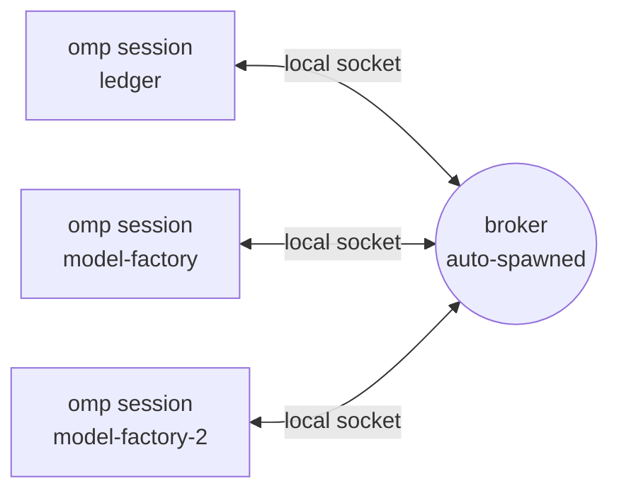

<p>
  
</p>

# omp-intercom

Agent-to-agent messaging for [omp](https://github.com/can1357/oh-my-pi) sessions on one machine.

Every top-level omp session joins automatically under a readable name taken from its repo, and knows who else is online without being told. Tell one agent "send the model factory agent a hello" and it finds `model-factory` and sends it. The message lands in that session as a new turn, and the answer comes back the same way.

Local only: sessions talk through a small broker on a local socket. Nothing leaves the machine.

This is a fork of [ersintarhan/omp-intercom](https://github.com/ersintarhan/omp-intercom), itself a port of [pi-intercom](https://github.com/earendil-works/pi-intercom) to the omp extension API. The fork adds automatic enrolment, peer profiles, the peer roster and fuzzy targeting; everything else is upstream behaviour. See [What this fork adds](#what-this-fork-adds).



## Why

omp's built-ins cover one agent with many viewers (`/collab`) and subagents inside one process (the Agent Hub). omp-intercom connects separate omp processes as peers: one agent can hand work to another, ask it a question and wait, or share what it found.

## Install

From a local checkout (`omp plugin link` only accepts paths inside the current directory):

```bash
git clone https://github.com/josh-at-straker/omp-intercom.git
cd omp-intercom
bun install          # dev dependencies, for the tests only
omp plugin link .
omp plugin list      # shows omp-intercom@0.2.0-straker.1
```

New omp sessions load the plugin at startup. Sessions that were already running pick it up after a restart.

Roll back with `omp plugin uninstall omp-intercom`. The broker exits on its own once nothing is connected.

The upstream npm package (`omp install npm:omp-intercom`) is upstream behaviour only, without this fork's additions.

## Using it

### From an agent

You don't pass session ids. Each session's system prompt carries an `<omp-intercom-peers>` block listing the live peers, so a plain request works:

> send the MF agent a note that the facts contract is additive only

The agent calls the `intercom` tool with your words as the target:

```typescript
intercom({ action: "send", to: "the MF agent", message: "The facts contract is additive only." })
// → Message sent to model-factory
```

If two peers match equally, the call fails and lists both. The agent picks one or asks you which.

The main actions:

| Action | What it does |
|---|---|
| `list` | Live sessions with repo, branch, role, activity and status |
| `list-cwd` | Only sessions in one working directory |
| `send` | Deliver a message and carry on working |
| `ask` | Deliver a message and wait for the reply (10 minutes by default, `PI_INTERCOM_ASK_TIMEOUT_MS`) |
| `reply` | Answer an inbound `ask` |
| `pending` | Inbound asks still waiting for a reply |
| `cancel` | Request cancellation of a sent message |
| `status` | Connection status |

Use `send` for handoffs and notifications, and `ask` only when the agent is blocked on the answer. An inbound message arrives as a turn, and the sender can't see the recipient's normal output, so the recipient answers through intercom: `reply` to an ask, `send` otherwise.

`send` and `ask` also accept `cwd` (target the only live session in that directory) and `attachments` (code snippets or files):

```typescript
intercom({
  action: "send",
  to: "worker",
  message: "Here's the fix:",
  attachments: [{ type: "snippet", name: "auth.ts", language: "typescript", content: "function validate() { ... }" }],
})
```

The bundled `omp-intercom` skill has ready-made patterns: planner and worker, research to implementation handoff, pair debugging, progress reports.

### From the keyboard

Press **Alt+I** or run `/intercom` to pick a session, write a message and send it.

| Command | What it does |
|---|---|
| `/intercom` | Open the session picker and compose a message |
| `/alias <name>` | Name this session. An explicit name always wins over the auto-name |
| `/intercom-role <role>` | Publish a role other agents can target, e.g. `leadership`. `/intercom-role clear` removes it |
| `/intercom-id` | Insert this session's intercom target into the editor, for handoff notes |

## How names and targeting work

### Names

A session with no explicit name takes one from where it runs:

| Where the session runs | Name |
|---|---|
| git repo `~/str/code/model-factory` | `model-factory` |
| a second session in the same repo | `model-factory-2`, then `-3` |
| linked worktree `omp-intercom-a2a` of repo `omp-intercom` | `omp-intercom-a2a` |
| plain directory `/tmp/x` | `x` |

- `/alias` or a manual session rename always wins.
- omp's auto-generated session title is never used as the name. It's shown to peers as the session's current activity.
- A name holds for the life of the session. If two sessions start at once, the later one renames, and a freed name is never reclaimed mid-session.
- An auto-name never takes a name that belongs to an offline session with an explicit alias, while that session can still receive queued mail. The newcomer takes `<name>-2` instead.

### Targets

The `to` field is tried in this order: exact session id, exact name, id prefix, then a fuzzy match on peers' names, repos, worktrees, roles and activity. The fuzzy step understands joined words and acronyms, so `modelfactory`, `model factory` and `the MF agent` all reach `model-factory`. Ties return the candidates instead of guessing. A name that belongs to an offline explicit session skips the fuzzy step entirely, so the message is queued for that session rather than delivered to a live peer that merely mentions the word.

### Peer profiles

Alongside its name, each session publishes a short profile: repo, worktree, branch, role, session title and intent (the first line of the latest prompt). The title and intent are clipped, and anything that looks like a credential is masked, because both end up in other agents' system prompts. The broker validates each field and caps it at 160 characters. No environment variables, tokens or full prompts are published.

### The roster

Before each prompt, the extension adds the `<omp-intercom-peers>` block to the system prompt: the session's own name, then one line per live peer (name, repo, cwd, role, activity), up to 12 peers and 2,000 characters including the overflow line. The block is rebuilt each time rather than accumulated, and it's never written to the transcript. Live status (idle, thinking) stays out of it so the provider's prompt cache isn't invalidated every turn; `list` shows live status.

### Safety

- **Mail can't be stolen by name.** Auto-names are runtime-only, so the broker never hands queued messages to a new process because it came up with the same derived name. Only an explicit alias is a mailbox identity.
- **Subagents stay out.** A session whose history contains omp's `session_init` entry (task and eval subagents, `/tan` clones, revived sessions) never joins, gets no roster, and can't use the tool. Subagents talk to their parent through omp's own IRC and Agent Hub. If the session state can't be read, the session doesn't join.
- **Inbound turns are configurable.** `inboundTrigger` controls whether an inbound message starts a turn (see Configuration).

## Configuration

`~/.omp/agent/intercom/config.json`, all keys optional:

```json
{
  "enabled": true,
  "confirmSend": false,
  "inboundTrigger": "always",
  "autoName": true,
  "peerRoster": true
}
```

| Key | Default | Meaning |
|-----|---------|---------|
| `enabled` | `true` | `false` disconnects and hides intercom |
| `confirmSend` | `false` | Ask for confirmation before each `send` |
| `inboundTrigger` | `"always"` | `"always"` starts a turn for every inbound message; `"replies"` only for replies to your asks; `"never"` shows messages without starting a turn |
| `sessionId` | unset | Pin a restart-stable intercom session id |
| `autoName` | `true` | Derive a name from the repo or directory. `false` restores upstream's `omp-chat-…` runtime alias |
| `peerRoster` | `true` | Add the `<omp-intercom-peers>` roster to each top-level session's system prompt |

`OMP_INTERCOM_ROLE` sets a default role; `/intercom-role` overrides it for the session.

State and config live under `~/.omp/agent/intercom`, or under `$PI_CODING_AGENT_DIR/intercom` if omp was started with that override:

- `broker.sock`: the broker's socket (a named pipe on Windows; `PI_INTERCOM_TRANSPORT=tcp` opts into loopback TCP)
- `broker.pid` and `broker.spawn.lock`: broker process id and startup lock
- `pending-asks/`: local records of asks waiting for a reply
- `broker-launch.vbs`: Windows only, launches the broker without a console window

Under omp (Bun) the broker runs `broker/broker.ts` directly. Under Node it falls back to the bundled `tsx` CLI; override with `brokerCommand` and `brokerArgs`.

### Recommended `AGENTS.md` note

The tool description, the skill and the roster already carry the guidance, but a short note in `AGENTS.md` makes the intent explicit:

```xml
<omp-intercom>
Other local omp sessions are listed in <omp-intercom-peers>. When the user mentions another agent, message it with the intercom tool, passing their words as `to`. Never ask the user for session ids. Use `send` to hand off and keep working, `ask` only when blocked on the answer. Subagents aren't peers.
</omp-intercom>
```

If your `~/.omp/agent/AGENTS.md` is shared with pi (for example through a symlink), start the section with a line telling pi agents to ignore it: pi uses pi-intercom, which has a separate broker.

## How it works

- **Broker** (`broker/broker.ts`): a small local process that tracks connected sessions, routes direct messages and queues mail for explicitly named sessions that briefly disconnect. It starts on first use and exits when idle.
- **Extension** (`index.ts`): registers the `intercom` tool, the commands above, the Alt+I shortcut, presence heartbeats, the roster hook and the inline message renderer.
- **Fork modules**: `peer-identity.ts` (names, profiles, subagent detection), `peer-match.ts` (fuzzy targeting), `roster.ts` (the roster block). The broker protocol gained one optional `profile` field, so older clients still connect and upstream changes still merge.
- **Presence**: each session advertises its name, cwd, model, context use, live status (`idle`, `thinking`, `tool:<name>`) and profile.

Other extensions in the same session can use omp-intercom as a message bus through the shared `pi.events` bus. See `extension-api.ts` for the `INTERCOM_EXTENSION_REGISTER_EVENT` contract.

## Limits

- One machine only. There is no network transport.
- omp only. pi sessions run pi-intercom on a separate broker, so omp and pi agents can't message each other yet. The upstream `mesh-hub` branch works on a shared broker for both.
- Subagent detection relies on omp writing a `session_init` entry, because the extension API doesn't expose task depth. If omp stops writing it, subagents would join under derived names. They still couldn't inherit anyone's mail.
- Name changes are polled once a second, because omp has no rename event.

## Differences from pi-intercom

- Targets the omp extension API (`@oh-my-pi/*` packages and the `omp` manifest field)
- The shortcut is **Alt+I**, because omp reserves Alt+M
- Model presence refreshes at `turn_start`, because omp has no `model_select` event
- The `pi-subagents` bridge (`contact_supervisor`) and the Herdr pane integration aren't ported; omp subagents use the Agent Hub
- Tests run on `bun test`

## Development

```bash
bun install
bun run test
```

The broker uses plain Node APIs. The extension and UI import `@oh-my-pi/*` packages and need Bun.

## License

MIT
