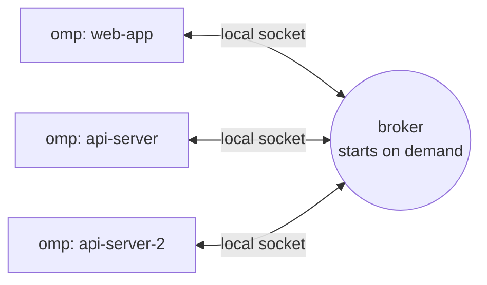

<p>
  
</p>

# omp-intercom

Lets the [omp](https://github.com/can1357/oh-my-pi) sessions on your machine talk to each other.

Start omp in two repos and each session joins automatically, named after its repo. Every session knows who else is online. Say "ask the api agent whether the orders endpoint changed" in one session, and it finds the `api-server` session, asks, and carries on with the answer. No session ids, no setup.

Everything stays on your machine. Sessions talk through a small broker on a local socket that starts on demand and exits when idle.



## Requirements

- **omp** with plugin support. Tested on omp 18.3. Nothing else to install: the plugin runs inside omp, which bundles Bun.
- **One machine, one OS user.** The broker's directory is private to your user (`0700`), so sessions belonging to other users can't connect.
- **Platforms.** Tested end to end on macOS. The Linux and Windows code paths (Windows uses a named pipe) come from upstream and haven't been tested on this fork.

## Install

```bash
omp plugin install github:JoshTickles/omp-intercom
```

New omp sessions load the plugin at startup. Restart any session that was already running.

| To | Run |
|---|---|
| Check it's installed | `omp plugin list` (shows `omp-intercom@0.2.0-straker.1`) |
| Update to the latest `main` | `omp plugin install github:JoshTickles/omp-intercom --force` |
| Pin a tag or commit | `omp plugin install github:JoshTickles/omp-intercom#<ref>` |
| Remove it | `omp plugin uninstall omp-intercom` |

The broker exits by itself once no session is connected, so uninstalling needs no cleanup.

**Don't use `omp plugin install omp-intercom`.** That installs the upstream npm package, which has the messaging but none of the automatic names, peer roster or fuzzy targeting described here.

### From a checkout

For hacking on the plugin:

```bash
git clone https://github.com/JoshTickles/omp-intercom.git
cd omp-intercom
omp plugin link .
```

A linked plugin loads straight from the checkout, so new sessions run whatever branch is checked out. Don't delete or move the checkout while it's linked. You only need `bun install` to run the tests.

## Quick start

1. Open two terminals and start omp in two different repos, for example `~/code/api-server` and `~/code/web-app`.
2. They join as `api-server` and `web-app`. Run `/intercom` in either one to see the other.
3. In `web-app`, type:

   > ask the api agent whether the /orders response shape changed this week

The `web-app` agent calls the `intercom` tool with `to: "the api agent"`, which resolves to `api-server`. The question arrives in `api-server` as a new turn. That agent answers with `reply`, and `web-app` picks up the answer and carries on.

## Using it

### From an agent

The agent already knows who's online. Before each prompt, the plugin adds a short roster to the system prompt:

```text
<omp-intercom-peers>
You are "web-app" on the local omp-intercom network. Live peer OMP sessions on this machine:
- api-server — api-server · ~/code/api-server — working on: Paginate the orders endpoint
- data-pipeline — data-pipeline · ~/code/data-pipeline — role: reviewer
(two lines of usage guidance)
</omp-intercom-peers>
```

So a plain request works, and the agent passes your words straight through as the target:

```typescript
intercom({ action: "send", to: "the api agent", message: "Orders now paginate; first page is 50." })
// → Message sent to api-server (matched "the api agent")
```

If two sessions match equally well (say `api-server` and `api-server-2`), the call fails and lists both. The agent then picks one or asks you which.

| Action | What it does |
|---|---|
| `list` | Live sessions with repo, branch, role, activity and status |
| `list-cwd` | Only the sessions in one working directory |
| `send` | Deliver a message and keep working |
| `ask` | Deliver a message and wait for the reply (10 minutes by default; set `PI_INTERCOM_ASK_TIMEOUT_MS` in milliseconds) |
| `reply` | Answer an inbound `ask` |
| `pending` | Inbound asks still waiting for a reply |
| `cancel` | Ask to cancel a message you sent |
| `status` | Connection status |

Use `send` for handoffs and updates, and `ask` only when the agent can't continue without the answer. The sender never sees the recipient's normal output, so the recipient answers through intercom: `reply` to an ask, `send` for anything else.

`send` and `ask` also take `cwd` (target the only live session in that directory) and `attachments` (files or code snippets):

```typescript
intercom({
  action: "send",
  to: "web-app",
  message: "Here's the new client:",
  attachments: [{ type: "snippet", name: "orders.ts", language: "typescript", content: "export async function listOrders() { ... }" }],
})
```

The plugin ships an `omp-intercom` skill with ready-made patterns: planner and worker, research handoff, pair debugging, progress reports.

### From the keyboard

| Key or command | What it does |
|---|---|
| **Alt+I** or `/intercom` | Pick a session, write a message, send it |
| `/alias <name>` | Give this session a fixed name, which always beats the automatic one |
| `/intercom-role <role>` | Publish a role other agents can target, such as `reviewer`. `/intercom-role clear` removes it |
| `/intercom-id` | Put this session's intercom target in the editor, for handoff notes |

## Names and targeting

### Automatic names

A session you haven't named takes its name from where it runs:

| Where the session runs | Name |
|---|---|
| git repo `~/code/api-server` | `api-server` |
| a second session in the same repo | `api-server-2`, then `-3` |
| linked git worktree `api-hotfix` of `api-server` | `api-hotfix` |
| plain directory `/tmp/scratch` | `scratch` |
| your home directory | `home` |

- `/alias`, or renaming the session, always wins.
- omp's auto-generated session title is never used as the name. Peers see it as what the session is working on.
- A session keeps its name for life. If two start at the same moment, the later one takes the `-2`. A name freed by a session that quits is not reclaimed mid-session.
- An automatic name never takes a name that belongs to an offline session with an `/alias`, because that session may still have mail queued. The newcomer gets `<name>-2`.

### What `to` accepts

`to` is tried in order: exact session id, exact name, id prefix, then a fuzzy match against each peer's name, repo, worktree, role and current activity. The fuzzy step understands joined words and initials, so `api server`, `apiserver` and `the api agent` all reach `api-server`, `the DP agent` reaches `data-pipeline`, and `the reviewer` reaches whichever session published that role. Ties return the candidates instead of guessing.

If the name belongs to an offline session with an `/alias`, the fuzzy step is skipped: the message waits in that session's mailbox rather than going to a live peer that happens to look similar.

### What other sessions can see

Each session publishes a short profile: repo, worktree, branch, role, session title, and intent (the first line of your latest prompt). These end up in other agents' prompts, so the title and intent are clipped, anything that looks like a credential is masked, and the broker caps every field at 160 characters. Environment variables, tokens and full prompts are never published.

The roster holds at most 12 peers and 2,000 characters, and is rebuilt for each prompt rather than saved to the transcript. It leaves out live status (idle, thinking) so it doesn't break the model provider's prompt cache every turn; `list` shows live status.

### Safety

- **Mail can't be stolen by name.** Automatic names are never mailbox identities, so a new session that happens to get the same name can't collect another session's queued messages. Only an `/alias` owns a mailbox.
- **Subagents stay out.** Sessions omp spawns from another session (task and eval subagents, `/tan` clones, revived sessions) never join, get no roster, and can't use the tool. They talk to their parent through omp's own IRC and Agent Hub. If the plugin can't read the session state, the session doesn't join.
- **You choose whether messages start turns.** `inboundTrigger` (below) controls whether an incoming message makes the agent act on its own.

## Configuration

Optional. Create `~/.omp/agent/intercom/config.json`; every key is optional:

```json
{
  "enabled": true,
  "confirmSend": false,
  "inboundTrigger": "always",
  "autoName": true,
  "peerRoster": true
}
```

| Key | Default | Meaning |
|-----|---------|---------|
| `enabled` | `true` | `false` disconnects and hides intercom |
| `confirmSend` | `false` | Ask you before every `send` |
| `inboundTrigger` | `"always"` | `"always"`: every incoming message starts a turn. `"replies"`: only replies to your own asks do. `"never"`: messages are shown but never start a turn |
| `sessionId` | unset | Pin a fixed intercom session id that survives restarts |
| `autoName` | `true` | Name sessions after their repo or directory. `false` falls back to upstream's `omp-chat-…` names |
| `peerRoster` | `true` | Add the peer roster to each session's system prompt |
| `brokerCommand`, `brokerArgs` | unset | Override how the broker is launched (rarely needed) |

| Environment variable | Effect |
|---|---|
| `OMP_INTERCOM_ROLE` | Default role for new sessions; `/intercom-role` overrides it |
| `PI_INTERCOM_ASK_TIMEOUT_MS` | How long `ask` waits for a reply |
| `PI_INTERCOM_TRANSPORT=tcp` | Use loopback TCP instead of a Unix socket or named pipe |
| `PI_CODING_AGENT_DIR` | omp's own agent directory override; intercom state moves with it |

State lives in `~/.omp/agent/intercom/` (or `$PI_CODING_AGENT_DIR/intercom/`): `broker.sock`, `broker.pid`, `broker.spawn.lock`, and `pending-asks/` for asks waiting on a reply.

### Optional: a note in `AGENTS.md`

The tool description, roster and skill already tell the agent how to behave. A short note in `~/.omp/agent/AGENTS.md` makes it explicit:

```xml
<omp-intercom>
Other local omp sessions are listed in <omp-intercom-peers>. When the user mentions another agent, message it with the intercom tool, passing their words as `to`. Never ask the user for session ids. Use `send` to hand off and keep working, `ask` only when blocked on the answer. Subagents aren't peers.
</omp-intercom>
```

If pi reads the same `AGENTS.md` (through a symlink, say), start the section with a line telling pi to ignore it.

## How it works

- **Broker** (`broker/broker.ts`): a small local process that tracks connected sessions, routes messages, and holds mail for aliased sessions that briefly disconnect. The first session to need it starts it; it exits when nothing is connected.
- **Extension** (`index.ts`): the `intercom` tool, the commands, Alt+I, presence heartbeats, the roster, and how incoming messages are shown.
- **Naming and targeting**: `peer-identity.ts` (names, profiles, subagent detection), `peer-match.ts` (fuzzy targets), `roster.ts` (the roster block).
- **Presence**: each session advertises its name, cwd, model, context use, live status (`idle`, `thinking`, `tool:<name>`) and profile.

Other extensions in the same session can use intercom as a message bus through `pi.events`; see `extension-api.ts` for the contract.

## Limits

- Same machine only; there is no network transport.
- omp only. pi sessions use pi-intercom on a separate broker, so omp and pi agents can't message each other.
- Subagent detection relies on omp writing a `session_init` entry to the session. If a future omp stops writing it, subagents would join under automatic names, though they still couldn't take anyone's mail.
- Name changes are picked up within a second (omp has no rename event).

## About this fork

This is a fork of [ersintarhan/omp-intercom](https://github.com/ersintarhan/omp-intercom), which ported [pi-intercom](https://github.com/earendil-works/pi-intercom) to omp. Messaging, the broker, `/intercom` and `/alias` are upstream. This fork adds automatic names, peer profiles, the roster, fuzzy targeting and `/intercom-role`. Its protocol changes are optional, additive fields, so upstream clients still connect to this broker.

Compared with pi-intercom: it uses the omp extension API, the shortcut is Alt+I (omp reserves Alt+M), and the pi-subagents bridge and Herdr pane integration aren't ported, since omp subagents use omp's Agent Hub instead.

## Development

```bash
git clone https://github.com/JoshTickles/omp-intercom.git
cd omp-intercom
bun install
bun run test
```

The broker uses plain Node APIs. The extension and UI import `@oh-my-pi/*` packages, which omp provides at runtime and `bun install` provides for the tests.

## License

MIT
